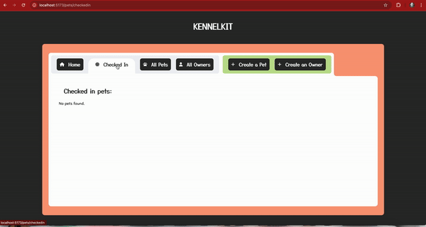

# Kennelkit

Kennelkit is an app designed to help kennel employees store and organize information on their client and easily check pets in and out of their system. My final project for Techtonica. Current deployment can be viewed here on [Vercel](https://kennelkit.vercel.app/).

## Setup Instructions (Local)

1. Clone the repo onto your local machine.
2. cd into the client directory and run `npm install`.
3. cd into the server directory and run `npm install`.
4. To set up the database:
   - Ensure that postgres is installed on your machine.
   - If you have postgres set up with a user, run `psql -U postgres kennel -f db.sql`.
   - If your configuration doesn't require a user, run `psql kennel -f db.sql`.
5. Fill in the required variables in .envexample and rename the file to .env. (API keys for both The Dog API and The Cat API are free for basic access. Note that this application does not currently use any information that requires a key with either API, but will in the future.)
6. While still in the server directory, run `npm run start`.
7. Fill in the .envexample file with "localhost:[host you gave for server env]" and rename the file to .env.
8. Navigate back to the client directory and run `npm run dev`. Click on the link provided in your console output, and you'll be able to view the app.
9. Checking in a pet:
      - 
- Note: more demos to come

## Component List

- [x] Homepage
- [x] Loading Screen
- [x] Navbar
-     Props: selected (number)

### Owner Components

- [x] All Owners List
- [x] Create Owner Form
- [x] Edit Owner Form
-     Props: owner (object)
- [x] Owner Item
-     Props: owner (object)
- [x] Owner List View
-     Props: list (array)
- [x] Owner Profile
- [x] Owner Profile Tabs
-     Props: pets (array)

### Pet Components

- [x] All Pets List
- [x] Checked In Pets List
- [x] Check In Toggle
-     Props: id (number), checkedin (boolean)
- [x] Create Pet Form
- [x] Dropdown Filter
-     Props: options (array), placeholder (string), onChange (function), isDisabled (boolean)
- [x] Edit Pet Form
-     Props: pet (object), owner (object)
- [x] Pet Item
-     Props: pet (object)
- [x] Pet List View
-     Props: list (array)
- [x] Pet Profile
- [x] Pet Profile Icon Bar
-     Props: isChecked (boolean), staytype (string)
- [x] Pet Profile Tabs
- [x] Pet Stats
-     Props: pet (object), owner (object)

## Testing

- [x] All components: test that they are being rendered

### Pet Component Testing

- [x] Pet Item: Test that dog icon renders for dogs and cat icon render for cats
- [x] Pet Item: Test that the sex icon is being rendered correctly
- [x] Pet Stats: Test that dog icon renders for dogs and cat icon renders for cats
- [x] Pet Stats: Test that sex icon is being rendered correctly
- [x] Pet Stats: Test that altered string renders correctly in all combinations
- [x] Pet Profile Icon Bar: Test that check in icon is only rendered if pet is checked in and correct stay type icon is rendered
- [x] Pet List View: Test that the list view correctly renders individual items OR a message indicating that there are no items in the list
- [x] Pet Item: Test that links are being generated for each item
- [ ] Create Pet Form: Test that when no species is selected, breeds are disabled, when cats are selected, cat breeds are rendered, and when dogs are selected, dog breeds are rendered
- [ ] Edit Pet Form: Test that all default information renders

### Owner Component Testing

## Saving, Sending, and Updating Data

- Each time a form is filled out, a post request will be sent to the server and will create either a new pet row or a new owner row.
- Each time a pet profile or owner profile is edited, a put request will be sent to the server and will update the row by id.
- Each time a pet profile or owner profile is deleted, a delete request will be sent to the server and will delete the row by id.
- Each time a pet is checked in or out, a put request will be sent to the server and will update the pet's status.
- To retrieve information on both a pet and an owner, tables will be joined where the id row for owners match the pet row "owner ids"
- Each time a list or profile view is rendered, a get request will be sent to the server to retrieve an owner or pet by id
- For the search function, get requests will be made based on the filter criteria (phone number, breed, etc)

## Stretch Goals & Extra Features (By Theme & Priority Level)

- ### Pet Profile Theme
-     Ability to delete pet
-     Ability to search for pet by filter criteria
- ### Owner Profile Theme
-     Ability to delete owner
-     Ability to search for owner by filter criteria
- ### Feeding Theme
-     *Ability to add feeding schedule to pet profile*
-     *Ability to add meals to pet history*
-     Ability to generate a feeding schedule for all checked in pets
- ### Medication Theme
-     *Ability to add medication schedule to pet profile*
-     *Ability to add medication to pet history*
-     Ability to generate a medication schedule for all checked in pets
- ### Boarding Theme
- ### Vaccination Theme
- ### Reservation Theme
